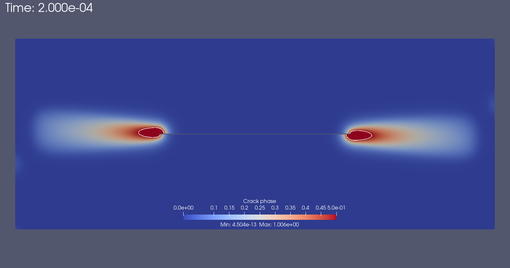

# Ductile Phase Field
## FEniCSx implementation of a phase field model for ductile fracture

### Introduction
This repository contains the implementation of a phase field model for ductile fracture in FEniCSx. The model is based on the work of [Miehe et al. (2010)](https://doi.org/10.1016/j.jmps.2010.06.006), [Ambati et al. (2015)](https://doi.org/10.1016/j.jmps.2015.07.011) and [Q. Zeng et al. (2022)](https://doi.org/10.1016/j.jmps.2022.104914). The model is implemented in Python using the finite element library FEniCSx.

### Installation
Please follow the instructions in the [FEniCSx download](https://fenicsproject.org/download/) to install FEniCSx on your system.
> [!NOTE]
> 1. The code is mainly developed and tested with FEniCSx version 0.9.0. 
> 2. Some examples may require the installation of additional Python packages like `tqdm`.
> 3. The code is developed and tested on Linux and macOS. Windows is not supported.

### Usage
```bash
python simple_shear.py
```
Or run it in mpi mode:
```bash
mpirun -n 4 python simple_shear.py
```

### Examples
1. **Simple shear test**: The file `simple_shear.py` contains the implementation of a simple shear test. The test is based on the work of [Q. Zeng et al. (2022)](https://doi.org/10.1016/j.jmps.2022.104914). The test is performed on a 2D domain with a simple shear loading condition with plane strain considered. The material parameters are chosen such that the material undergoes ductile fracture.
